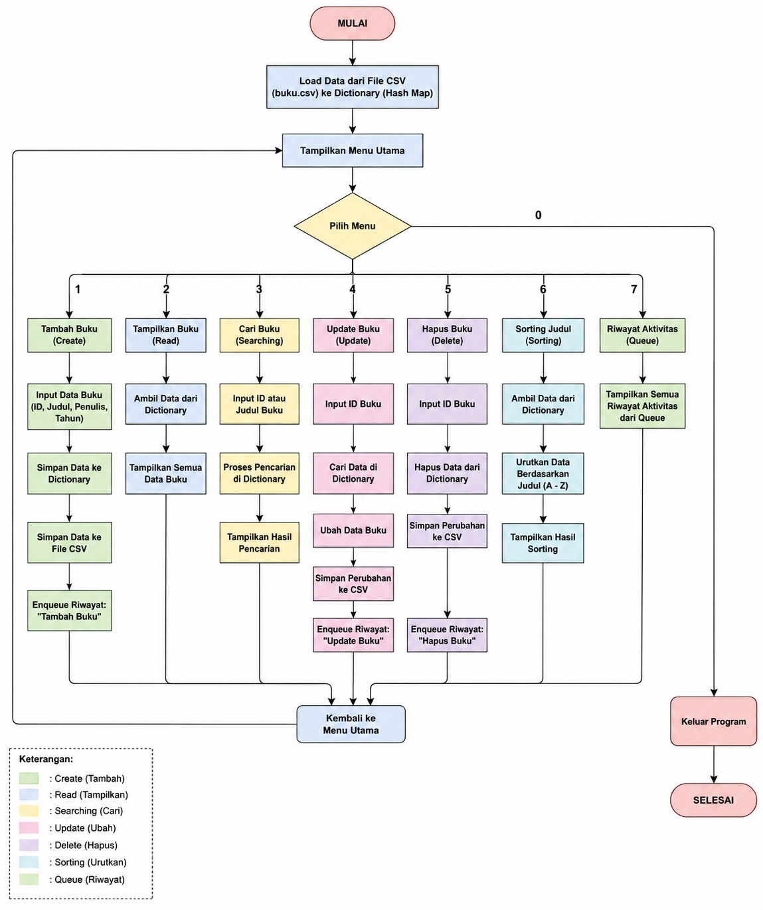

# Sistem Manajemen Perpustakaan

## Final Project Mata Kuliah Struktur Data

### Identitas Mahasiswa

* Nama: Intan Lestari
* Program Studi: Teknik Informatika
* Mata Kuliah: Struktur Data

---

## Deskripsi Program

Sistem Manajemen Perpustakaan adalah aplikasi berbasis Command Line Interface (CLI) yang dikembangkan menggunakan bahasa pemrograman Python dengan penyimpanan data menggunakan file CSV sebagai Flat File Database.

Program ini digunakan untuk mengelola data buku perpustakaan melalui operasi CRUD (Create, Read, Update, Delete), Searching, dan Sorting. Selain itu, program juga menerapkan beberapa konsep Struktur Data yang telah dipelajari selama perkuliahan, seperti Dictionary (Hash Map), Stack, Linear Search, dan Bubble Sort.

---

## Tujuan Program

* Mengelola data buku perpustakaan secara sederhana.
* Mengimplementasikan operasi CRUD.
* Mengimplementasikan algoritma Searching dan Sorting.
* Menggunakan file CSV sebagai media penyimpanan data.
* Menerapkan konsep Struktur Data pada studi kasus nyata.

---

## Fitur Program

### 1. Create (Tambah Buku Baru)

Menambahkan data buku baru ke dalam sistem dan menyimpannya ke file CSV.

Data yang disimpan meliputi:

 ID Buku
 Judul Buku
 Penulis
 Tahun Terbit
 Genre 
 Stok

### 2. Read (Lihat Semua Buku)

Menampilkan seluruh data buku yang tersimpan pada sistem.

### 3. Update (Update Data Buku)

Mengubah informasi buku berdasarkan ID Buku yang dipilih.

### 4. Delete (Hapus Buku)

Menghapus data buku berdasarkan ID Buku.

### 5. Searching (Linear Search)

Mencari data buku berdasarkan judul atau ID buku menggunakan algoritma Linear Search.

### 6. Sorting (Bubble Sort)

Mengurutkan data buku berdasarkan judul buku menggunakan algoritma Bubble Sort.

### 7. Riwayat Pencarian (Stack)

Menyimpan riwayat pencarian pengguna menggunakan struktur data Stack.

---

## Struktur Data dan Algoritma yang Digunakan

### Dictionary (Hash Map)

Dictionary digunakan sebagai media penyimpanan data buku di memori agar proses pencarian dan manipulasi data menjadi lebih cepat.

Contoh:

```python
data_buku = {
    "001": {
        "judul": "Butterflies",
        "penulis": "Ale",
        "tahun": "2021"
    }
}
```

### Stack

Stack digunakan untuk menyimpan riwayat pencarian pengguna dengan prinsip LIFO (Last In First Out).

Contoh aktivitas:

* Cari "Hujan"
* Cari "Dilan 1990"
* Cari "Butterflies"

Data pencarian terakhir akan berada di posisi teratas stack.

### Linear Search

Digunakan untuk mencari buku berdasarkan kata kunci yang dimasukkan pengguna.

### Bubble Sort

Digunakan untuk mengurutkan data buku berdasarkan judul secara alfabetis.

---

## Implementasi CRUD

### Create

Menambahkan data buku baru ke dalam sistem.

### Read

Menampilkan seluruh data buku yang tersimpan.

### Update

Mengubah data buku yang sudah ada.

### Delete

Menghapus data buku dari sistem.

---

## Struktur Folder

```text
SistemPerpustakaan/
│
├── main.py
├── buku.csv
├── flowchart.png
└── README.md
```

### Keterangan File

| File          | Fungsi                                      |
| ------------- | ------------------------------------------- |
| main.py       | Program utama Sistem Manajemen Perpustakaan |
| buku.csv      | Database penyimpanan data buku              |
| flowchart.png | Diagram alur program                        |
| README.md     | Dokumentasi proyek                          |

---

## Database

Program menggunakan file CSV sebagai media penyimpanan data.

Contoh isi file:

```csv
ID,Judul,Penulis,Tahun,Genre,Stok
001,Butterflies,Ale,2021,Romance,2
002,KKN di Desa Penari,Simpleman,2019,Horror,2
003,Dilan 1990,Pidi Baiq,Romance,2014,10
004,Hujan,Tere Liye,Romance,2016,2
```

---

## Cara Menjalankan Program

1. Buka folder proyek menggunakan Visual Studio Code.
2. Pastikan Python sudah terinstal.
3. Buka Terminal.
4. Jalankan program dengan perintah:

```bash
python main.py
```

5. Pilih menu yang tersedia.

---

## Tampilan Menu Program

```text
=============================================
   📚 SISTEM MANAJEMEN PERPUSTAKAAN 📚
=============================================

[1] Lihat Semua Buku
[2] Tambah Buku Baru
[3] Update Data Buku
[4] Hapus Buku
[5] Cari Buku (Linear Search)
[6] Urutkan Buku (Bubble Sort)
[7] Riwayat Pencarian (Stack)
[0] Keluar

=============================================
```

---

## Flowchart

Flowchart sistem tersedia pada file:


## Kesimpulan

Program Sistem Manajemen Perpustakaan berhasil dibuat menggunakan Python dengan penyimpanan data berbasis CSV. Program telah memenuhi ketentuan Final Project Struktur Data dengan mengimplementasikan CRUD (Create, Read, Update, Delete), Dictionary (Hash Map), Linear Search, Bubble Sort, Stack, serta Flat File Database (.CSV).


